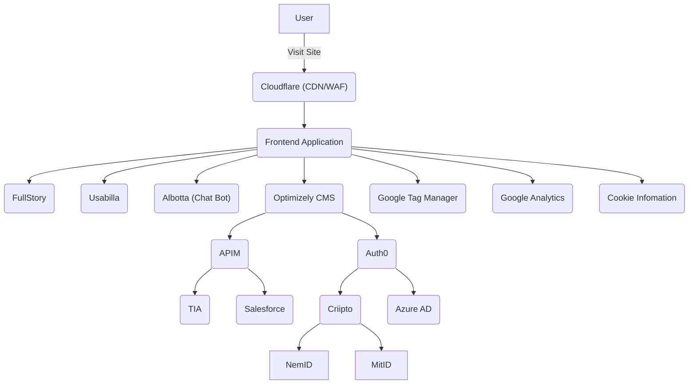

# Online Overview

```mermaid
graph TD
    User[User] -->|Visit Site| CDN("Cloudflare (CDN/WAF)")
    CDN --> Frontend(Frontend Application)
    
    Frontend --> FullStory(FullStory)
    Frontend --> Usabilla(Usabilla)
    Frontend --> Albotta("Albotta (Chat Bot)")
    Frontend --> CMS(Optimizely CMS)
    Frontend --> GTM(Google Tag Manager)
    Frontend --> GA("Google Analytics")
    Frontend --> CookieInfomation(Cookie Infomation)
    
    CMS --> APIM(APIM)
    CMS --> Auth0(Auth0)

    APIM --> TIA(TIA)
    APIM --> SF(Salesforce)
    
    Auth0 --> Criipto("Criipto")
    Auth0 --> AAD(Azure AD)

    Criipto --> NemID
    Criipto --> MitID
```
